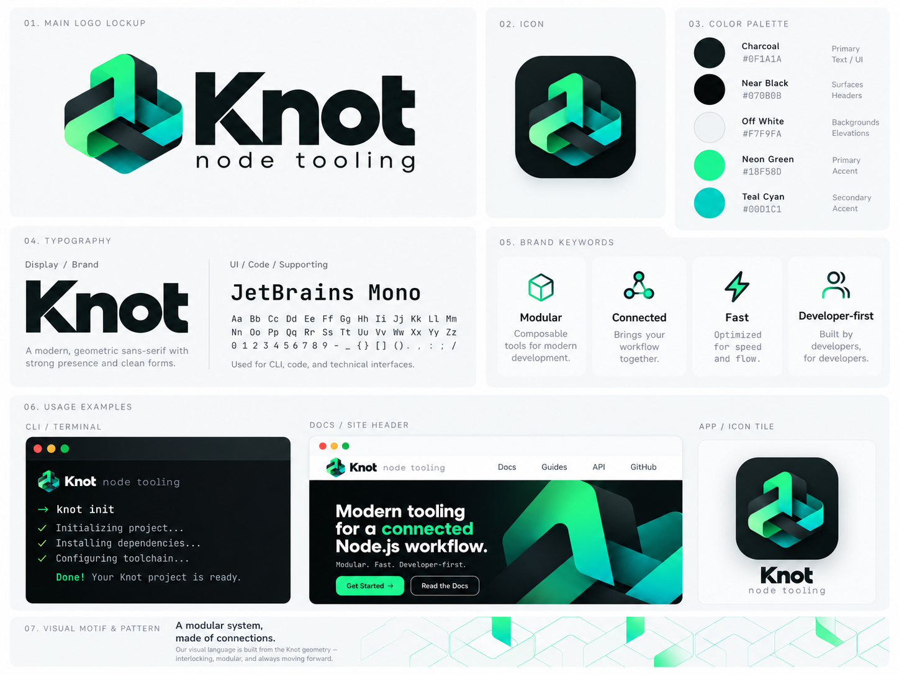

<div align="center">


# Knot

**Modern tooling for a connected Node.js workflow.**

[Website](https://matheusbbarni.github.io/knot-node-tooling/) · [Commands](#commands) · [Architecture](#architecture) · [Roadmap](#roadmap) · [Design documents](#design-documents)

</div>

Knot is a native JavaScript toolchain written in [Bend2](https://github.com/bendlang/bend).
It brings package management, TypeScript transformation, bundling, and testing under one CLI without bundling V8 or another general-purpose JavaScript runtime into the toolchain.

<details>
<summary>View the Knot visual identity</summary>

<p align="center">
  
</p>

</details>

> [!IMPORTANT]
> Knot 0.0.1 is published as [`@matheusbbarni/knot`](https://www.npmjs.com/package/@matheusbbarni/knot).
> Build `bin/knot` from this repository with `./scripts/build-knot` when you need the latest source changes.
> Package management, TypeScript transformation, graph analysis, and an initial JavaScript build path run in this tree.
> The test runner is still planned.
> Transpilation does not type-check or emit `.d.ts` files.
> The pinned toolchain is Bend 2.0.24 in [`toolchain.json`](./toolchain.json).

## Overview

Knot aims to make the common Node.js workflow one coherent toolchain:

```text
knot install
knot build
knot test
```

The project is organized around four connected systems:

- **Package manager:** npm-compatible registries, verified downloads, deterministic `knot.lock` files, an isolated `node_modules` layout, and a content-addressed store.
- **Compiler:** JavaScript and TypeScript transformation, JSX lowering, module scanning, resolution, source maps, and incremental rebuilds.
- **Bundler:** JavaScript graph linking, tree shaking, code splitting, CSS, HTML, static assets, manifests, and atomic publication.
- **Test runner:** Native coordination with isolated Node.js workers, assertions, snapshots, coverage, reports, and watch selection.

Knot generates code for Node.js and browsers.
Execution remains with those external runtimes.

## Design goals

- Correct behavior and reproducible output before benchmark wins.
- Deterministic lockfiles, build artifacts, reports, and cache identities.
- Safe recovery from interruption, crashes, corrupt caches, and concurrent processes.
- Strict package visibility that prevents undeclared dependencies by default.
- Atomic activation of complete install and build generations.
- Full functionality on CPU-only systems.
- Optional multicore and GPU execution only where measurements show an end-to-end gain.

## Commands

The following commands currently run from this source tree.
The test runner remains planned.

| Command | Status | Purpose |
| --- | --- | --- |
| `knot install` | Available | Resolve, fetch, verify, and materialize project dependencies |
| `knot add <spec>` | Available | Add and install a direct dependency |
| `knot remove <name>` | Available | Remove a direct dependency |
| `knot fetch` | Available | Populate the package store without creating project links |
| `knot why <name>` | Available | Explain why a package exists in the dependency graph |
| `knot run <script>` | Available | Execute a `package.json` script with the declared Node.js engine |
| `knot scan <files...>` | Available for a TypeScript subset | Print runtime imports and exports as JSON |
| `knot analyze <entrypoints...>` | Available for a TypeScript subset | Print reachable entries, modules, and missing imports as JSON |
| `knot build --no-bundle <files...>` | Available for a TypeScript subset | Transform files without linking them into a bundle |
| `knot build <entrypoints...>` | Available for a JavaScript/TypeScript subset | Resolve, tree-shake, and emit application outputs |
| `knot test [filters...]` | Planned | Discover, compile, isolate, and execute tests |

`knot run <script>` reads the named entry from `package.json` scripts, validates `engines.node` against the current Node.js runtime, and executes the command without a shell.

Older PRDs use the working name `bnpm`.
The public names are `knot`, `knot.toml`, `knot.lock`, `node_modules/.knot`, and `knot:test`.

## Install

Install the published CLI globally with any supported package manager:

```sh
npm install --global @matheusbbarni/knot
bun add --global @matheusbbarni/knot
pnpm add --global @matheusbbarni/knot
```

## Build from source

### Prerequisites

- Node.js 24 LTS.
- Bend 2.0.24 installed from the verified pin in [`toolchain.json`](./toolchain.json).
- A native C compiler supported by Bend2.
- On the current macOS development setup, the build wrapper uses Homebrew LLVM and LLD through [`scripts/cc`](./scripts/cc).

The capability gate documents the pinned artifacts, host effects, backend behavior, and acceptance requirements in [`docs/bend2-capability.md`](./docs/bend2-capability.md).

### Build and test

```sh
./scripts/build-knot
./bin/knot --help
node --test
```

`node --test` is the independent acceptance driver.
It launches the real `knot` process and checks observable files, output, network requests, child processes, generated JavaScript, and recovery behavior where applicable.

Run the compiler examples after building:

```sh
./bin/knot transpile examples/compiler/basic/greet.ts
node examples/compiler/basic/greet.js
./bin/knot analyze examples/compiler/analyze-graph/main.ts
```

See [`examples/compiler/README.md`](./examples/compiler/README.md) for JSX, runtime TypeScript, and source-map examples.

## Package management

`knot install` uses npm-compatible registries and writes `knot.lock`.
Verified tarballs are stored in `~/.knot/cas`.
Extracted package trees are stored in `~/.knot/unpacked`.
Registry metadata is stored in `~/.knot/cache`.
Use `--store-dir` to select another store root.

The project layout places materialized packages under `node_modules/.knot` and exposes declared dependencies through links in `node_modules`.
A later install can rematerialize packages from the unpacked store after `node_modules` is removed.
Lifecycle scripts remain disabled unless explicitly approved by the project.

The package manager is designed around these safety boundaries:

- Verify integrity before package content becomes visible.
- The implementation must reject archive traversal, absolute paths, symlink escapes, special files, excessive entries, and declared-size abuse before materialization.
- Keep cache writes and project activation atomic.
- Support offline and frozen installs without implicit network access.
- Fail explicitly instead of falling back to npm, pnpm, Bun, or another tool.

Benchmark methodology and limitations are recorded in [`benchmark/package-manager/`](./benchmark/package-manager/).
The repeated measurements compare cached rematerialization on a specific fixture, and the resolver experiment separately records one cold-metadata run with its cache and graph limitations.

## Compilation and bundling

`knot transpile` and `knot build --no-bundle` currently support a practical JavaScript and TypeScript subset.
They erase type annotations, interfaces, type aliases, `import type`, `as` assertions, and `satisfies` expressions.
They also lower JSX, numeric enums, value namespaces, constructor parameter properties, and import assignments covered by the current fixtures.

The compiler supports classic, automatic, and preserved JSX modes.
It emits linked, external, or disabled source maps.
Identifier and whitespace minification are available for supported inputs.

The current JavaScript build path can:

- Follow relative imports, `require()` targets, `tsconfig.json` path aliases, and package `exports` or `main` entries.
- Honor build conditions and `sideEffects` metadata.
- Build reachable graphs and remove unused function declarations from non-entry modules.
- Emit content-hashed dynamic-import chunks and CommonJS `require()` targets.
- Write JSON build metadata with `--metafile`.
- Reuse unchanged outputs through `.knot/build-cache/v1`.
- Rebuild affected inputs with `--watch`.

Basic CSS extraction, HTML module-entry rewriting, JSON/text modules, and static-asset copying are available in the current bundler slice.
Full CSS transforms, standards-aware HTML reference rewriting, and production asset naming remain in progress.

Builds do not install packages or access the network implicitly.
A failed build must not expose a mixture of old and new artifacts.

## Test runner

`knot test` is planned as a native Bend2 coordinator with external Node.js worker processes.
The default isolation boundary will be one process per test file.

The planned runner includes:

- JavaScript, TypeScript, JSX, TSX, ESM, and CommonJS tests.
- Nested suites, hooks, assertions, mocks, spies, fake time, and snapshots.
- File-level parallelism, deterministic sharding, retries, and seeded randomization.
- Hard deadlines and complete process-tree cleanup.
- Source-mapped V8 coverage.
- Console, dots, JUnit XML, GitHub Actions, and JSON Lines reporters.
- Dependency-aware watch selection.

Tests are trusted project code, not sandboxed workloads.
The native coordinator remains responsible for deadlines, cleanup, event validation, and final process status.

## Architecture

```text
package.json + knot.toml + knot.lock
                 |
                 v
       manifest and configuration
                 |
        +--------+---------+
        |                  |
        v                  v
 package resolver    compiler resolver
        |                  |
        v                  v
 verified store      immutable module IR
        |                  |
        v          +-------+--------+
 isolated links    |                |
                   v                v
              build graph       test graph
                   |                |
                   v                v
          staged artifacts   Node.js workers
                   |                |
                   v                v
          atomic activation   validated reports
```

Filesystem, network, process, signal, and terminal work stays at explicit effect boundaries.
Parsing, graph planning, canonicalization, hashing, validation, reachability, and serialization remain pure or bounded where practical.
Every required feature keeps a CPU path.

## Development model

Knot uses test-driven development for behavioral changes:

1. Write one failing acceptance test at a public seam.
2. Confirm that it fails because the behavior is missing.
3. Implement the smallest complete path.
4. Exercise the real executable, generated output, or browser surface.
5. Refactor while focused and related checks remain green.

Bend2 laws and proofs supplement executable tests for pure invariants.
They do not replace runtime tests for filesystems, networks, processes, JavaScript behavior, crashes, or browsers.

## Website

The project website is a static Astro site published to GitHub Pages.
Run it locally with:

```sh
cd website
pnpm install --frozen-lockfile
pnpm dev
```

Build the static site with `pnpm build`.

## Roadmap

1. Keep the pinned Bend2 toolchain and CPU acceptance gate reproducible.
2. Expand the npm-compatible resolver, verified store, isolated linker, and lifecycle policy.
3. Expand JavaScript and TypeScript parsing, transforms, resolution, source maps, and incremental compilation.
4. Complete JavaScript linking, tree shaking, code splitting, CSS, HTML, assets, and atomic production output.
5. Deliver the isolated Node.js test runner, assertions, reporting, snapshots, coverage, and watch mode.
6. Enable multicore and GPU stages only when equivalent output and end-to-end gains are demonstrated.

## Product boundaries

Knot does not embed a JavaScript runtime.
It does not provide static TypeScript type checking or declaration generation.
It does not install packages or access the network during builds.
Package lifecycle scripts are not enabled by default.
GPU hardware is optional.
Unsupported behavior fails with a diagnostic instead of silently falling back to another tool.

## Design documents

| Document | Scope |
| --- | --- |
| [Package manager PRD](./docs/package-manager-prd.md) | Registry resolution, lockfile, verified store, isolated linking, security, and recovery |
| [Compiler PRD](./docs/ts-compiling-prd.md) | JavaScript and TypeScript parsing, transformations, resolution, source maps, and incremental compilation |
| [Bundler PRD](./docs/bundler-prd.md) | JavaScript linking, code splitting, CSS, HTML, assets, caching, and atomic publication |
| [Test runner PRD](./docs/test-runner-prd.md) | Discovery, isolated execution, assertions, snapshots, coverage, reporting, and watch mode |
| [TDD plan](./tdd-plan.md) | Public test seams, red-green-refactor workflow, fixtures, CI levels, and initial vertical slices |
| [Bend2 capability](./docs/bend2-capability.md) | Pinned toolchain, commands, effects, and host adapters |
| [npm distribution](./docs/npm-distribution.md) | Scoped npm packages, platform binaries, and the release gate for publishing `knot` |
| [Knot vs Bun](./benchmark/package-manager/knot-bun-comparison.md) | Cached install rematerialization against Bun |
| [Knot vs npm](./benchmark/package-manager/knot-npm-comparison.md) | Cached install rematerialization against npm 11 |
| [Knot vs pnpm](./benchmark/package-manager/knot-pnpm-comparison.md) | Cached install rematerialization against pnpm 11 |

The dedicated PRD for a subsystem is authoritative when documents overlap.
The bundler PRD owns graph, linker, chunk, CSS, HTML, asset, and output behavior.
The TDD plan owns verification process and regression levels.
